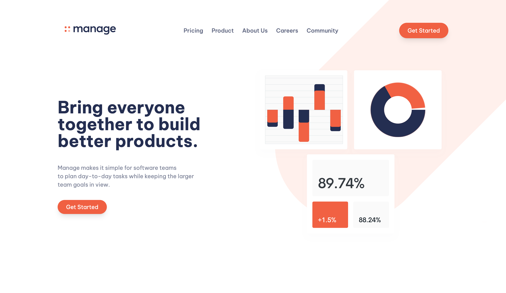
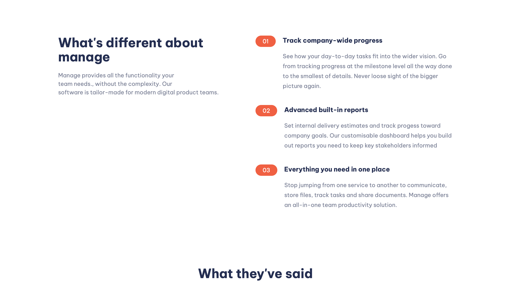

# Frontend Mentor - Manage landing page solution

This is a solution to the [Manage landing page challenge on Frontend Mentor](https://www.frontendmentor.io/challenges/manage-landing-page-SLXqC6P5). Frontend Mentor challenges help you improve your coding skills by building realistic projects.

## Table of contents

- [Overview](#overview)
  - [The challenge](#the-challenge)
  - [Screenshot](#screenshot)
  - [Links](#links)
- [My process](#my-process)
  - [Development](#development)
  - [Built with](#built-with)
  - [What I learned](#what-i-learned)
  - [Continued development](#continued-development)
  - [Useful resources](#useful-resources)
- [Author](#author)
- [Acknowledgments](#acknowledgments)

## Overview

### The challenge

Users should be able to:

- View the optimal layout for the site depending on their device's screen size
- See hover states for all interactive elements on the page
- See all testimonials in a horizontal slider
- Receive an error message when the newsletter sign-up `form` is submitted if:
  - The `input` field is empty
  - The email address is not formatted correctly

### Screenshot




### Links

- Solution URL: [https://github.com/cyonii/manage-landing-page](https://github.com/cyonii/manage-landing-page)
- Live Site URL: [https://cyonii.github.io/manage-landing-page/](https://cyonii.github.io/manage-landing-page/)

## My process

### Built with

- Semantic HTML5 markup
- CSS
- Flexbox
- Mobile-first workflow
- [TailwindCSS](https://tailwindcss.com/) - a utility-first CSS framework

### What I learned

Before this project, I always preferred [Bootstrap](https://getbootstrap.com/) because it has a lot of useful built-in components. However, I also wanted to learn how to use TailwindCSS to build a responsive website.

Taking on this challenge was a lot of fun. I have come to understand what is meant by TailwindCSS being a utility-first CSS framework because, unlike Bootstrap, TailwindCSS does not provide a full set of components. Instead, it provides a set of useful low-level utility classes that can be used to build much more complex and responsive components.

The crazy part for me is that you can style elements based on their state. For example, you can style an element in different states e.g, `:hover` or `:focus` or `:invalid`.

```html
<!-- Changes `color` on hover -->

<nav class="flex flex-col space-y-3 text-gray-600">
  <a href="#" class="hover:text-red-500">Careers</a>
  <a href="#" class="hover:text-red-500">Community</a>
  <a href="#" class="hover:text-red-500">Privacy Policy</a>
</nav>
```

### Continued development

Currently, the mobile menu is not fully functional, for example, it does not open when you click on the menu icon. I will implement this feature soon.

### Useful resources

- [TailwindCSS Documentation](https://tailwindcss.com/docs/installation) The official documentation for TailwindCSS is a great resource for learning how to use it. It is beginner-friendly and easy to follow.

## Development

```bash
  npm install # Install dependencies
  npm run build # Compile TailwindCSS
  npm run watch # Watch for changes
```

## Author

- Website - [Github](https://cyonii.github.io/)
- Frontend Mentor - [@cyonii](https://www.frontendmentor.io/profile/cyonii)
- Twitter - [@__cyk0](https://www.twitter.com/__cyk0)

## Acknowledgments

Thank you to [Frontend Mentor](https://www.frontendmentor.io/) for creating this challenge. It is a great resource for learning how to build responsive websites. I observed that this challenge covers a lot of aspects of building a responsive web page, e.g. responsive layout, responsive typography, responsive images, form validation, element ordering, mobile-first design, etc.
